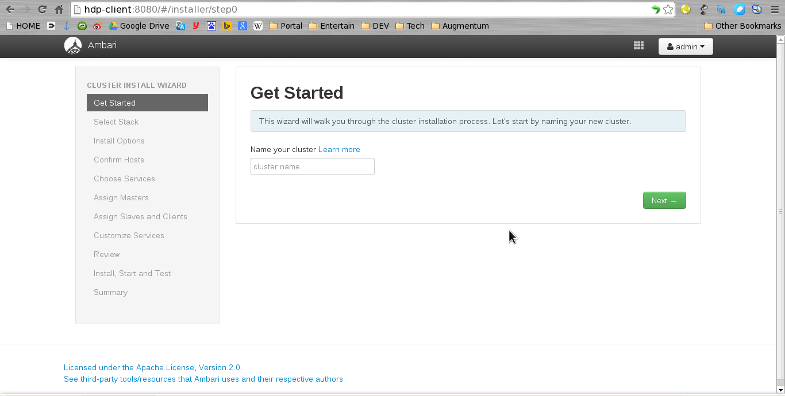



Apache Ambari needs a server node and several agent nodes. The ambari-agenet service needs to be installed on each node in your Hadoop cluster. You can choose one client server as ambari-service server. So that, you can use ambari-web management to control your Hadoop cluster.

##Preparation for Installation

###Install JDK (version >= 1.7) for each node

    sudo yum install -y java-1.7.0-openjdk

###Create login user without sudo PWD for each node

    sudo vi /etc/sudoers

Add or edit lines like:

    user        ALL=(ALL)       ALL
    %user       ALL=(ALL)       NOPASSWD: ALL

###Add hostname and shutdown IPv6 support for each nodes

    sudo hostname hdp-client

    sudo vim /etc/hosts

Your Hadoop cluster nodes. Example:

>192.168.0.101 hdp-client
>192.168.0.102 hdp-nn
>192.168.0.103 hdp-dn1
>192.168.0.104 hdp-dn2
>192.168.0.105 hdp-dn3
>192.168.0.106 hdp-dn4

_**DO NOT**  give more than **1** directories to each IP address. Or it would cause 'heartbeat lost' exception._

    sudo vim /etc/sysconfig/network

Add or edit lines like:

>NETWORKING=yes
>HOSTNAME=hdp-client
>IPV6INIT=no
>IPV6_INIT=no
>NETWORKING_IPV6=no

##Stop SELinux while the installation

    sudo vim /selinux/config

Change __SELINUX=enforcing__ to __SELINUX=disable__

_If you didn't find __selinux__ stuff, it means SELinux is default closed._

##Stop iptables service

    sudo chkconfig iptables off

##Start ntpd service on one master node

    sudo yum install -y ntpd
    sudo chkconfig ntpd on

##Add time synchronizing trigger for each node

    sudo crontab -e

Add lines for

__Master node__

    0-59/10 * * * * /usr/sbin/ntpdate 0.rhel.pool.ntp.org

__Other node__

    0-59/10 * * * * sudo /usr/sbin/ntpdate hdp-client

###Add passwordless SSH access for each node

Assume A is your ambari-service node, and B is one of your ambari-agent node. You want to use user a on node A to access B as user b via SSH without password.

First log in on A as user a and generate a pair of authentication keys.

_**DO NOT** enter a passphrase._

    ssh-keygen -t rsa

    Generating public/private rsa key pair.
    Enter file in which to save the key (/home/a/.ssh/id_rsa): 
    Created directory '/home/a/.ssh'.
    Enter passphrase (empty for no passphrase): 
    Enter same passphrase again: 
    Your identification has been saved in /home/a/.ssh/id_rsa.
    Your public key has been saved in /home/a/.ssh/id_rsa.pub.
    The key fingerprint is:
    3e:4f:05:79:3a:9f:96:7c:3b:ad:e9:58:37:bc:37:e4 a@A

Now use ssh to create a directory ~/.ssh as user b on B. (The directory may already exist, which is fine):

    ssh b@B mkdir -p .ssh

    b@B's password: 

Finally append a's new public key to b@B:.ssh/authorized_keys and enter b's password one last time:

    cat .ssh/id_rsa.pub | ssh b@B 'cat >> .ssh/authorized_keys'

    b@B's password: 

From now on you can log into B as b from A as a without password:

    ssh b@B

A note from one of our readers: Depending on your version of SSH you might also have to do the following changes:

1. Put the public key in .ssh/authorized_keys2
2. Change the permissions of .ssh to 700
3. Change the permissions of .ssh/authorized_keys2 to 640

---

##Install with yum

###Prepare for local yum repository

Download Ambari tarballs in one packaged by Horntonworks

    wget -nv http://public-repo-1.hortonworks.com/ambari/centos6/ambari-1.7.0-centos6.tar.gz
    wget -nv http://public-repo-1.hortonworks.com/HDP/centos6/HDP-2.2.0.0-centos6-rpm.tar.gz
    wget -nv http://public-repo-1.hortonworks.com/HDP-UTILS-1.1.0.20/repos/centos6/HDP-UTILS-1.1.0.20-centos6.tar.gz

Extract each package to __/home/user/repo.local__ . The folder structure may like:

    ---/home/user/repo.local
      |--ambari_1.x
      |--HDP
      |--HDP-UTILS-1.1.0.20

Create local repository

    sudo yum install -y createrepo

    cd /home/user/repo.local
    createrepo -v ambari_1.x
    createrepo -v HDP
    createrepo -v HDP-UTILS-1.1.0.20

Install httpd service on your local repository server:

    sudo yum install -y httpd

    cd /var/www/html
    link -s /repository /home/user/repo.local

Create repo files:

    vim ambari.repo

>[Updates-ambari-1.7.0]
>name=ambari-1.7.0 - Updates
>baseurl=http://hdp-client/repository/ambari/centos6/1.x/updates/1.7.0
>gpgcheck=0
>gpgkey=http://hdp-client/repository/ambari/centos6/RPM-GPG-KEY/RPM-GPG-KEY-Jenkins
>enabled=1
>priority=1

    vim HDP.repo

>[HDP-2.2]
>name=HDP
>baseurl=http://hdp-client/repository/HDP/centos6/2.x/GA/2.2.0.0
>path=/
>enabled=1
>gpgcheck=0

    vim HDP-UTILS.repo 

>[HDP-UTILS-1.1.0.20]
>name=HDP-UTILS
>baseurl=http://hdp-client/repository/HDP-UTILS-1.1.0.20/repos/centos6
>path=/
>enabled=1
>gpgcheck=0

Copy these three repo files to each node

    scp ambari.repo root@hdp-client:/etc/yum.repos.d/ambari.repo
    scp HDP.repo root@hdp-client:/etc/yum.repos.d/HDP.repo
    scp HDP-UTILS.repo root@hdp-client:/etc/yum.repos.d/HDP-UTILS.repo

###Install Ambari Agent

Install ambari-agent service to each node

    sudo yum install -y ambari-agent

###Install Ambari Server

    sudo yum install -y ambari-server

###Ambari Server setup

    sudo ambari-server setup

---

##Install with Apache Ambari WEB management

Access [http://ambari-server-hostname:8080/](http://ambari-server-hostname:8080/)

__Username__: admin
__Password__: admin

Welcome page of Apache Ambari.

Click __Launch Install Wizard__ to start installing Ambari.

Give a name to you Hadoop cluster.

Type a name and click __Next__ button.

Select HDP([Hortonworks Data Platform](http://hortonworks.com/)) version. At this moment, the latest version is 2.2. 

The sub module versions of HDP 2.2.

Modify the repository to local.

Add hostnames of all your nodes.

_One hostname, one line._

Add SSH private key of the node which __ambari-server__ installed. And don't forget modify the user name which could access __sudo__ without password.

Register ambari-agent service to ambari-server.

Validate ambari-agent of all nodes.

Choose Hadoop services to be installed.

Assign master of all Hadoop services which you chosen.

Assign DataNode/NodeManager.

_**Performance Tip:** DataNode and NodeManager should better be chosen at the same node._

Modify Hadoop services configuration, including data source, password, etc. You can just fill in all the red-bordered blanks. You can change any of them after installation.

Installation and configuration list.

Hadoop services are installing.

A sample of finished installing Ambari Dashboard.

---

##Q&A

